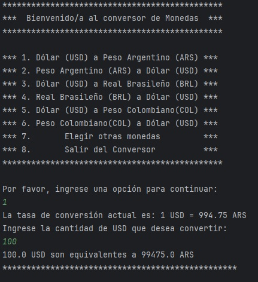
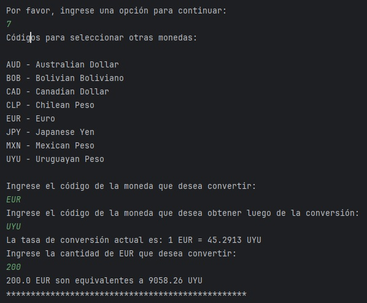
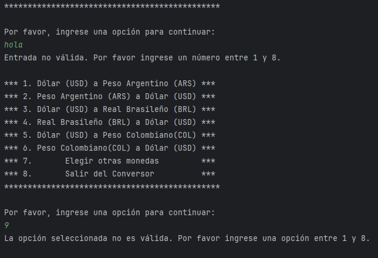

<h1 align="center"> :moneybag: :gem: | Conversor de Monedas con API |  :money_with_wings: :euro: </h1>
  

    
    
    
    
  

## :currency_exchange: Descripción del Proyecto 
Este es un emocionante desafío de programación en Java que consiste en la creación de un Conversor de Monedas. Éste deberá realizar solicitudes a una API de tasas de cambio en tiempo real, manipular datos JSON, filtrar y mostrar las monedas de interés para el usuario mediante diferentes métodos y realizar el correcto manejo de excepciones.

## 📋 Características

- Conversiones predefinidas mediante un menú de opciones
- Tasas de cambio en tiempo real
- Conversion de divisas utilizando códigos ISO
- Manejo de errores y validación de entrada

## :hotsprings: Tecnologías Utilizadas

- Java 17
- IntelliJ IDEA 
- ExchangeRate API v6
- CHATGPT4

## :warning: Requisitos 

- Java JDK 17 o superior
- Conexión a Internet (para obtener las tasas de cambio en tiempo real)

## 🚀 Ejemplos de Uso
Al iniciar, se presenta en consola un menú de opciones predefinidas para realizar la conversión. En caso de optar por alguna de éstas, se imprime la tasa de conversión actual y se pide al usuario que ingrese la cantidad de moneda que desea convertir para finalmente mostrar el resultado:

En caso de elegir la opción 7, se presenta en consola un nuevo menú para elegir los códigos de otras que no estan predefinidas. Para continuar la conversión el usuario deberá proporcionar el código ISO de la moneda que desea convetir, luego el código ISO de la moneda que desea obtener y finalmente el monto que desea convertir: 

Para finalizar el programa el usuario deberá seleccionar la opción número 8:

## :bangbang: Excepciones y validación de entradas

En caso de proporcionar una entrada alfabética o fuera de rango del menú de opciones, se imprime en consola un mensaje indicando el error y un bucle permite al usuario seleccionar una opción válida: 

En caso de proporcionar una entrada numérica o que no respete el códico ISO para las monedas, se imprime en consola un mensaje indicando el error y un bucle permite al usuario seleccionar una opción válida: 

## 📝 Licencia

Este proyecto está bajo la Licencia MIT - ver el archivo [LICENSE](LICENSE) para más detalles.

## 👤 Autor

- Jonathan Muller
- GitHub: [@jbmuller07](https://github.com/jbmuller07)
